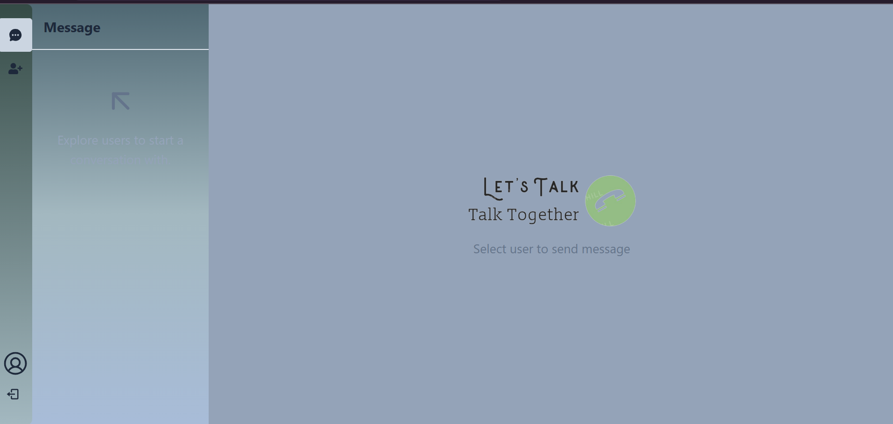
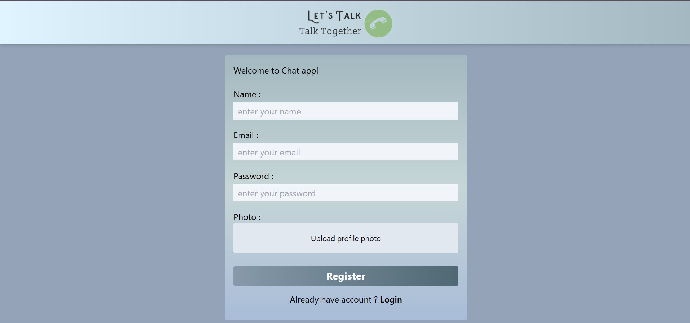
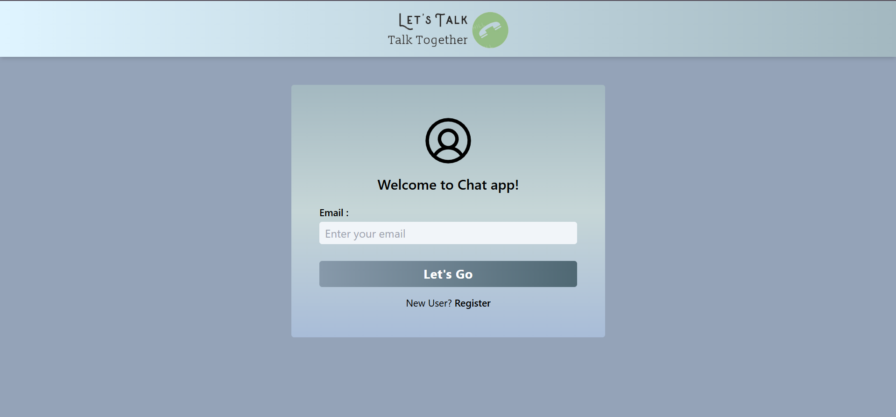
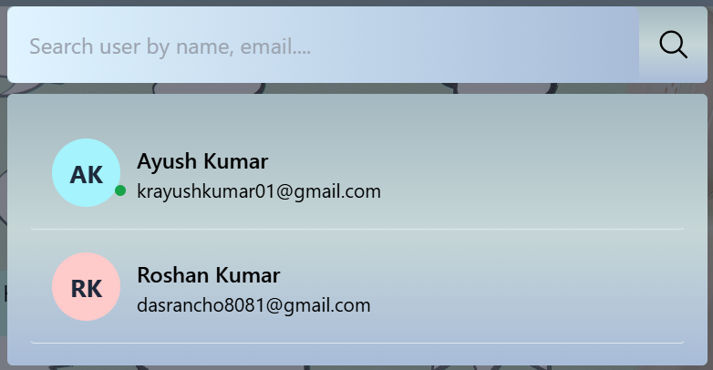
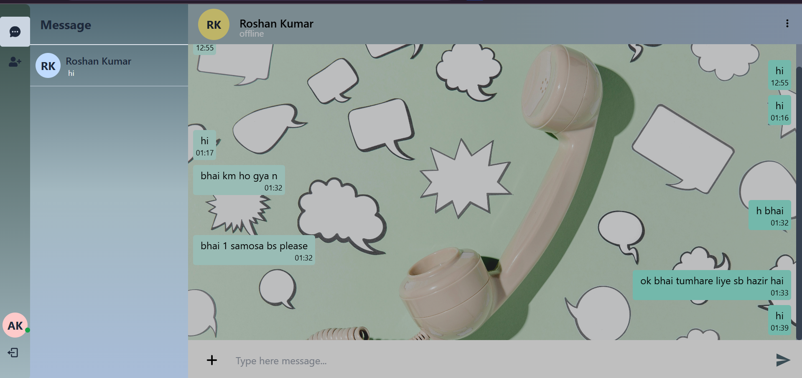

# Chat Application

This is a simple chat application created using [MERN].

## Features

- Real-time messaging
- User authentication
- Online status
- User search functionality

## Screenshots

  
  
<strong>Logo:</strong> This is the logo of our chat application.

  

  
  
<strong>Main Page:</strong> This is the main page of our chat application.

  

  
  
<strong>Register Page:</strong> This is the register page of our chat application.

  

  
  
<strong>Login Page:</strong> This is the login page of our chat application.

  

  
  
<strong>Search User:</strong> This page allows users to search for other registered users.

  

  
  
<strong>Sidebar and Chat Communication:</strong> This page displays the user's sidebar and open chat communication.

  

## Installation

1. Clone this repository.
2. [Insert installation steps here]

## Usage

1. [Insert usage instructions here]

## Contributing

Contributions are welcome! Please see [CONTRIBUTING.md](CONTRIBUTING.md) for more details.

## License

This project is licensed under the [MIT License](LICENSE).
